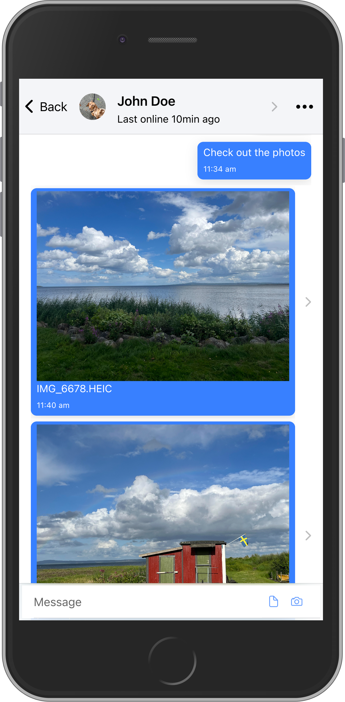
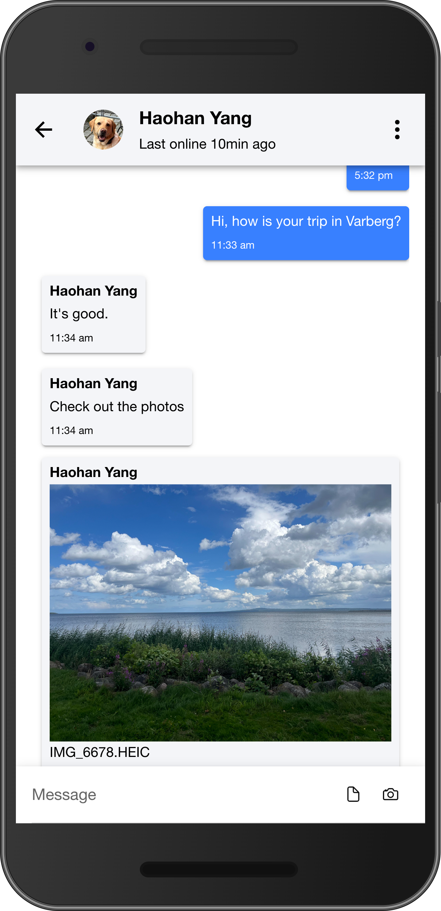

# Snack

Snack("chat" in Swedish) is a chat application built using the Ionic framework, React, Spring Boot, and AWS. The app can be easily installed on multiple devices as a PWA(Progressive Web App), thanks to Apple's support for the [Push API](https://developer.mozilla.org/en-US/docs/Web/API/Push_API). The application enables real-time messaging and showcases the integration of the Spring Framework with AWS and the great potential of PWA as a full-fledged mobile application. It allows users to communicate with
each other in real time, join chat rooms, participate in separate discussions, send multimedia content, and receive notifications. The client side code is on [snack-client](https://github.com/haohanyang/snack-client).


iOS View|Android View
:-------------------------:|:-------------------------:
|  

## Architecture


The app is hosted on AWS EC2, where a [caddy server](https://caddyserver.com) is used to serve the static frontend files and reverse proxy the API requests/WebSocket connections to the Dockerized Spring Boot application. The application also uses lots of other AWS services for object storage, authentication, etc.

## Features
**Real-time messaging**: The app uses Spring's WebSocket messaging on STOMP protocol to enable real-time messaging. On the client-side, the app uses [StompJs](https://stomp-js.github.io/) to connect to the WebSocket server.

**User authentication and authorization**: The app uses AWS Cognito for a JWT-based authentication and authorization. The client side uses AWS Amplify to interact with the Cognito service, and the server uses OAuth2 Resource Server to validate the JWT tokens from the clients. To synchronize the user data between Cognito user pool and SQL database, the app uses Cognito's sign-up triggers and invoke AWS Lambda functions to update the user entry.

**Multimedia support**: Users can send and receive images and other documents in the chat messages. The app uses AWS S3 to store the files and AWS Cloudfront to cache and deliver the files to the users.

**Push notifications**: The app uses Firebase Cloud Messaging and AWS SNS to send push notifications to the users when they are not actively using the app.

## Deployment
### Client side
The download the dist file(GitHub Action Artifact) via `utils/download_client_artifacts.py` after setting the `GH_TOKEN` environment variable. The script will download the latest artifact and extract the dist file to the `/var/www/snack-website` folder, which is the target of the file server.
### Server side
First, build the docker image 
```
docker build -t snack-server:v1 .
```
Before running the container, encrypt the secrets in the properties file using Jasypt
```bash
# Encrypt the properties file
./mvnw jasypt:encrypt -Djasypt.plugin.path="file:/path/to/properties" -Djasypt.encryptor.password="password"

# Run the container
docker run -it --name snack-server-container --mount type=bind,source=/path/to/properties,target=/config/application.properties -p 8080:8080 -e spring_profiles_active=prod snack-server:v1 --spring.config.location=/config/application.properties --jasypt.encryptor.password="password"
```
### Caddy server
Checkout `caddy/Caddyfile` for caddy configuration